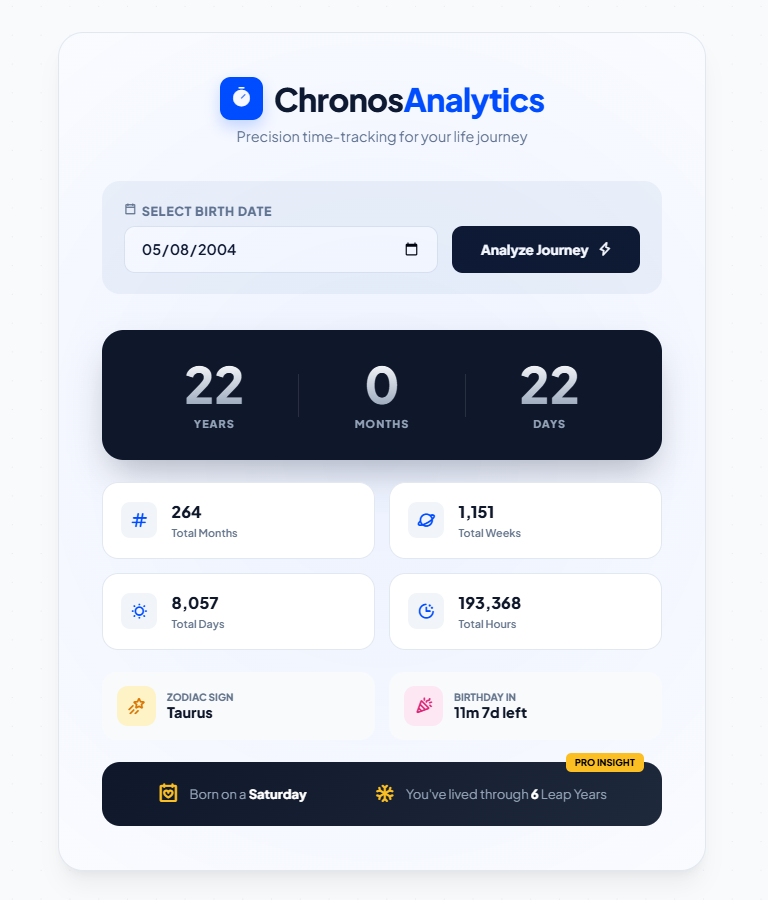

# ⏱️ ChronosAnalytics — Precision Age Analytics Dashboard

[](https://developer.mozilla.org/en-US/docs/Web/HTML)
[](https://developer.mozilla.org/en-US/docs/Web/CSS)
[](https://developer.mozilla.org/en-US/docs/Web/JavaScript)
[](https://opensource.org/licenses/MIT)

**ChronosAnalytics** is a high-end, responsive age analytics and lifetime metrics dashboard designed to provide a comprehensive, precision audit of a user's life journey. Moving far beyond simplistic age inputs, it calculates detailed lifespan metrics, astrological data, countdown highlights, and advanced chronological statistics wrapped in a modern, glassmorphic UI.

---

## 📸 Dashboard Showcase



*ChronosAnalytics features a sleek interface with real-time numerical animations, dynamic cards, and detailed lifespan analytics.*

---

## ✨ Features

- **📊 High-Precision Chronological Math:** Computes exact age in years, months, and days, instantly adapting to varying month lengths and leap cycles.
- **📈 Comprehensive Lifespan Analytics:** Delivers down-to-the-hour tracking of your life's total duration across:
  - Total Months Lived
  - Total Weeks Lived
  - Total Days Lived
  - Total Hours Lived
- **🌌 Astrological & Birth Details:** Computes and displays the user's exact western **Zodiac Sign** and identifies the precise **weekday of birth**.
- **🎉 Interactive Birthday Countdown:** Provides a dynamic countdown indicating the exact number of months and days remaining until the next birthday.
- **❄️ Pro Insights Panel:** Audits chronological milestones, including calculating the exact count of **Leap Years** lived through.
- **✨ Micro-Animations & Count-up Effects:** Features dynamic numerical count-up effects on page load/render, powered by a customized high-performance animators loop.

---

## 🎨 Design System & Aesthetics

- **Modern Typography:** Set in the high-end sans-serif font **Plus Jakarta Sans** for a premium digital-product feel.
- **Glassmorphism & Depth:** Leverages custom CSS3 variables, overlay card glows (`.card-glow`), smooth radial dot backdrops (`.dot-grid`), and subtle depth perspective transformations (`perspective: 1000px`).
- **Harmonious Palette:** Employs a tailormade dark and light theme using curated HSL color tokens to maximize contrast and aesthetic elegance.
- **Universal Responsiveness:** Designed from the ground up using mobile-first media queries to support smartphones, tablets, and full-scale desktop monitors.

---

## ⚙️ Core Engineering & Logic

### 1. High-Performance Count-Up Animations
Instead of instantly updating the metrics, ChronosAnalytics uses a recursive `requestAnimationFrame` loop to animate numbers smoothly over a designated duration (e.g., 1000ms–1200ms), ensuring a premium, responsive feel.
```javascript
function animateNumber(element, start, end, duration) {
  let startTime = null;
  const runner = (timestamp) => {
    if (!startTime) startTime = timestamp;
    const progress = Math.min((timestamp - startTime) / duration, 1);
    element.innerHTML = Math.floor(progress * (end - start) + start).toLocaleString();
    if (progress < 1) window.requestAnimationFrame(runner);
  };
  window.requestAnimationFrame(runner);
}
```

### 2. Lifespan Audit & Leap Year Logic
The system dynamically calculates the number of leap years experienced by iterating from the birth year to the current year, running the standard calendar algorithm:
```javascript
function countLeapYears(start, end) {
  let count = 0;
  for (let year = start; year <= end; year++) {
    if ((year % 4 === 0 && year % 100 !== 0) || (year % 400 === 0)) count++;
  }
  return count;
}
```

### 3. Astrological Mapping
Zodiac signs are accurately mapped using dates and custom monthly cut-off coordinates:
```javascript
function getZodiac(day, month) {
  const zodiacs = ["Capricorn", "Aquarius", "Pisces", "Aries", "Taurus", "Gemini", "Cancer", "Leo", "Virgo", "Libra", "Scorpio", "Sagittarius", "Capricorn"];
  const cutoff = [19, 18, 20, 19, 20, 20, 22, 22, 22, 22, 21, 21, 31];
  return day <= cutoff[month - 1] ? zodiacs[month - 1] : zodiacs[month];
}
```

---

## 📂 Repository Structure

```directory
Age-Calculator-App-js-project/
├── index.html       # Dynamic HTML5 markup structure and web layouts
├── style.css        # Premium typography, CSS3 animation loops, and variables
├── script.js       # Core chronological computations and dynamic animations
└── screenshot.png   # Dashboard interface visualization
```

---

## 🚀 Quick Start & Installation

To run this application locally, you do not need any compilation or build steps. 

1. **Clone the Repository:**
   ```bash
   git clone https://github.com/Imtiaz-Ali17314/ChronosAnalytics-Precision-Age-Analytics-Dashboard.git
   cd ChronosAnalytics-Precision-Age-Analytics-Dashboard
   ```

2. **Open the Application:**
   Simply double-click the `index.html` file or launch it using your favorite local development server (e.g., Live Server in VS Code, Vite, or a simple python server):
   ```bash
   # Python 3
   python -m http.server 8000
   ```
   Now visit `http://localhost:8000` in your web browser.

---

## 📜 License

This project is open-source and licensed under the **MIT License**. Feel free to use, modify, and distribute it as part of your learning journey or portfolio customization!
